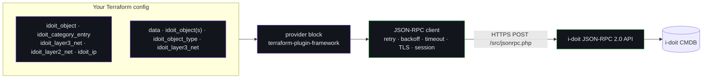
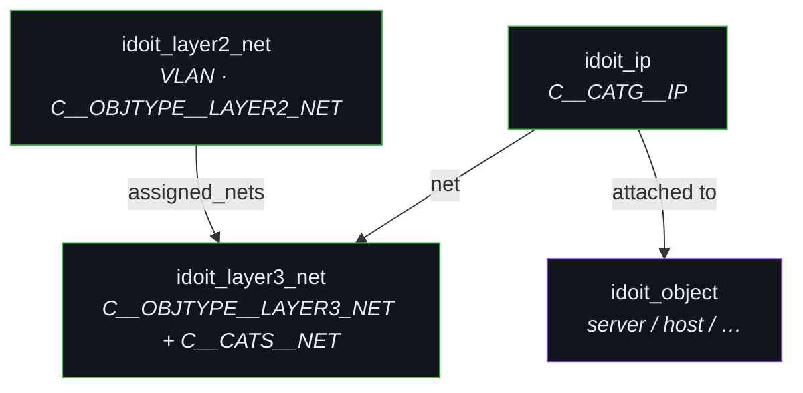

<!-- markdownlint-disable MD033 MD041 -->
<div align="center">



<p align="center">
  <a href="https://registry.terraform.io/providers/withakedo/i-doit/latest"></a>
  <a href="https://github.com/withakedo/terraform-provider-i-doit/releases"></a>
  <a href="https://github.com/withakedo/terraform-provider-i-doit/actions/workflows/ci.yml"></a>
  <a href="https://github.com/withakedo/terraform-provider-i-doit/actions/workflows/release.yml"></a>
  <a href="./go.mod"></a>
  <a href="./LICENSE"></a>
</p>

<p align="center">
  <b><a href="https://registry.terraform.io/providers/withakedo/i-doit/latest">Registry</a></b> &nbsp;•&nbsp;
  <b><a href="./docs">Provider docs</a></b> &nbsp;•&nbsp;
  <b><a href="./examples">Examples</a></b> &nbsp;•&nbsp;
  <b><a href="./docs/guides/network-category-keys.md">Network-key guide</a></b> &nbsp;•&nbsp;
  <b><a href="https://github.com/withakedo/terraform-provider-i-doit/issues">Issues</a></b>
</p>

<em>Manage the <a href="https://www.i-doit.com/">i-doit</a> CMDB declaratively — objects, category fields,<br/>Layer-2 / Layer-3 networks and IP address management — over the i-doit JSON-RPC API.</em>

</div>

---

Built on [`terraform-plugin-framework`](https://developer.hashicorp.com/terraform/plugin/framework)
with a small, dependency-free JSON-RPC client that talks to a single endpoint,
`<url>/src/jsonrpc.php`. No i-doit SDK, no CGO, one static binary per platform.

> [!NOTE]
> You need an i-doit installation with the **JSON-RPC API enabled** and an API key
> (*Administration → Interfaces / external data → JSON-RPC API*) plus
> **Terraform ≥ 1.5** (or OpenTofu). Go ≥ 1.23 is only needed to build from source.

<br/>

## ✨ Highlights

|  | |
|---|---|
| 🧱 **`idoit_object`** | Create / read / update / archive / purge any CMDB object. `terraform import` by numeric id. |
| 🗂 **`idoit_category_entry`** | Generic read/write for any global (`C__CATG__*`) or specific (`C__CATS__*`) category — **one entry per resource**, so multi-value categories work naturally. |
| 🌐 **`idoit_layer3_net` · `idoit_layer2_net` · `idoit_ip`** | Typed Layer-3 net, Layer-2 VLAN and IP-assignment resources for networking & IPAM, each with an `extra = {}` escape hatch for version-specific attribute keys. |
| 🔎 **Data sources** | `idoit_object`, `idoit_objects`, `idoit_object_type`, `idoit_layer3_net`. |
| 🔐 **Auth & TLS** | API-key auth, optional session login (`idoit.login`/`idoit.logout`), custom CA bundle, mutual TLS, SNI override, `insecure_skip_verify`. |
| ♻️ **Resilient client** | Per-request timeout, exponential-backoff retries on network / `429` / `5xx`, in-flight concurrency cap, and **precise not-found handling** — only a genuine "does not exist" removes a resource from state. |
| 🧩 **12-factor config** | Every argument reads from an environment variable; every secret is marked `sensitive`. |

<br/>

## 🚀 Quick start

```hcl
terraform {
  required_providers {
    idoit = {
      source  = "withakedo/i-doit"
      version = "~> 0.3"
    }
  }
}

provider "idoit" {
  url    = "https://cmdb.example.com" # without /src/jsonrpc.php
  apikey = var.idoit_apikey
}

resource "idoit_object" "web01" {
  type             = "C__OBJTYPE__SERVER"
  title            = "web01"
  purge_on_destroy = false # destroy => archive; true => purge
}

resource "idoit_category_entry" "web01_model" {
  object_id = idoit_object.web01.id
  category  = "C__CATG__MODEL"

  data = {
    manufacturer = "Dell"
    model        = "PowerEdge R660"
    serial       = "ABC123"
  }
}
```

> [!TIP]
> Prefer environment variables in CI: `IDOIT_URL`, `IDOIT_APIKEY`
> (and, if you use session auth, `IDOIT_USERNAME` / `IDOIT_PASSWORD`).
> On configure the provider calls `idoit.version` to verify reachability and credentials.

<br/>

## 🧩 Resources &amp; data sources

| Type | Name | i-doit mapping | `terraform import` id |
|---|---|---|---|
| resource | `idoit_object` | `cmdb.object.*` | `42` |
| resource | `idoit_category_entry` | `cmdb.category.save/read/delete` | `42/C__CATG__MODEL/17` |
| resource | `idoit_layer3_net` | `C__OBJTYPE__LAYER3_NET` + `C__CATS__NET` | `1234` |
| resource | `idoit_layer2_net` | `C__OBJTYPE__LAYER2_NET` + `C__CATS__LAYER2_NET` | `1235` |
| resource | `idoit_ip` | `C__CATG__IP` on an object | `42/17` |
| data | `idoit_object` | lookup by `id` **or** `title` + `type` | — |
| data | `idoit_objects` | filter by `type` / `title` → list | — |
| data | `idoit_object_type` | constant ↔ numeric id | — |
| data | `idoit_layer3_net` | lookup a Layer-3 net by `id` or `title` | — |

Full reference lives in [`docs/`](./docs) (generated with `tfplugindocs`) and on the
[Terraform Registry](https://registry.terraform.io/providers/withakedo/i-doit/latest/docs).

<br/>

## 🏗 Architecture



<br/>

## 🌐 Networking &amp; IPAM



```hcl
resource "idoit_layer3_net" "servers" {
  title       = "10.0.0.0/24 - servers"
  type        = "ipv4"
  address     = "10.0.0.0"
  cidr_suffix = "24"
  dns_server  = "10.0.0.1"
  range_from  = "10.0.0.10"
  range_to    = "10.0.0.250"
}

resource "idoit_layer2_net" "vlan100" {
  title          = "VLAN 100 - servers"
  vlan_id        = "100"
  layer3_net_ids = [idoit_layer3_net.servers.id]
}

resource "idoit_ip" "web01" {
  object_id    = idoit_object.web01.id
  net_id       = idoit_layer3_net.servers.id
  ipv4_address = "10.0.0.11"
  hostname     = "web01"
  primary      = true
}
```

> [!IMPORTANT]
> The exact `C__CATS__NET` / `C__CATS__LAYER2_NET` / `C__CATG__IP` attribute keys
> vary between i-doit versions. Each net resource accepts an `extra = { … }` map
> merged verbatim into the category payload, and everything stays reachable through
> the generic `idoit_category_entry`. See the
> **[network category-key guide](./docs/guides/network-category-keys.md)**.

<br/>

## 📚 Reference

<details>
<summary><b>Provider configuration</b> — every argument &amp; environment variable</summary>

<br/>

```hcl
provider "idoit" {
  url    = "https://cmdb.example.com" # without /src/jsonrpc.php
  apikey = var.idoit_apikey

  # optional session authentication
  # username = var.idoit_username
  # password = var.idoit_password

  request_timeout         = 60
  max_retries             = 3
  max_concurrent_requests = 10
  insecure_skip_verify    = false
  language                = "en"

  # custom TLS trust / mutual TLS (inline PEM or a path to a PEM file)
  # ca_cert         = file("~/certs/idoit-ca.pem")
  # client_cert     = file("~/certs/client.pem")
  # client_key      = file("~/certs/client-key.pem")
  # tls_server_name = "cmdb.internal"
}
```

| Argument | Env var | Default | Notes |
|---|---|---|---|
| `url` | `IDOIT_URL` | – | **required** |
| `apikey` | `IDOIT_APIKEY` | – | **required**, sensitive |
| `username` | `IDOIT_USERNAME` | – | sensitive; set with `password` |
| `password` | `IDOIT_PASSWORD` | – | sensitive; set with `username` |
| `request_timeout` | – | `60` | seconds, per request |
| `max_retries` | – | `3` | retries on network / `429` / `5xx` |
| `max_concurrent_requests` | – | `10` | in-flight request cap; `0` = unlimited |
| `insecure_skip_verify` | – | `false` | disable TLS verification (test only) |
| `ca_cert` | `IDOIT_CA_CERT` | – | extra CA(s); PEM data or file path |
| `client_cert` | `IDOIT_CLIENT_CERT` | – | mutual TLS; PEM data or file path |
| `client_key` | `IDOIT_CLIENT_KEY` | – | sensitive; PEM data or file path |
| `tls_server_name` | `IDOIT_TLS_SERVER_NAME` | – | SNI / certificate host override |
| `language` | `IDOIT_LANGUAGE` | `en` | API response language |

</details>

<details>
<summary><b>Importing existing objects</b></summary>

<br/>

```bash
terraform import idoit_object.web01           42
terraform import idoit_category_entry.model   42/C__CATG__MODEL/17
terraform import idoit_layer3_net.servers     1234
terraform import idoit_layer2_net.vlan100     1235
terraform import idoit_ip.web01               42/17
```

</details>

<details>
<summary><b>How <code>category_entry.data</code> drift detection works</b></summary>

<br/>

`data` is a `map(string)` sent verbatim to `cmdb.category.save`. Values are read
back with `cmdb.category.read` and reduced to scalars for drift detection:

- dialog / dialog+ attributes come back as objects and are collapsed to their
  `title` — configure those with the **value title**;
- fields that cannot be represented as a simple string are left untouched in state.

Attribute keys and accepted values are listed in i-doit under
*Administration → CMDB → Attribute documentation*.

</details>

<details>
<summary><b>Build &amp; install from source</b></summary>

<br/>

```bash
go mod tidy   # resolve dependencies (CI keeps go.sum in the repo)
make build    # -> ./terraform-provider-i-doit
make install  # -> ~/.terraform.d/plugins/registry.terraform.io/withakedo/i-doit/<version>/<os_arch>/
```

Point Terraform at the local build via `~/.terraformrc`:

```hcl
provider_installation {
  dev_overrides {
    "registry.terraform.io/withakedo/i-doit" = "/absolute/path/to/repo"
  }
  direct {}
}
```

</details>

<details>
<summary><b>Testing &amp; continuous integration</b></summary>

<br/>

```bash
make test        # unit tests (JSON-RPC client, retries, TLS, not-found, …)
make staticcheck # honnef.co/go/tools/cmd/staticcheck ./...
make lint        # golangci-lint run (install golangci-lint separately)
```

Acceptance tests create and delete real objects and are skipped unless `TF_ACC=1`:

```bash
export IDOIT_URL="https://demo.i-doit.com"
export IDOIT_APIKEY="<demo api key>"
export TF_ACC=1
make testacc
```

[`.github/workflows/ci.yml`](./.github/workflows/ci.yml) runs `go build`, `go vet`,
`go test` and `staticcheck` on every push and pull request. On pushes to `main` it
also regenerates `go.sum` and re-applies `gofmt`, committing the result, so the
module stays reproducible without a hand-maintained `go.sum`.

</details>

<details>
<summary><b>Cutting a release</b></summary>

<br/>

Pushing a `v*` tag triggers [`.github/workflows/release.yml`](./.github/workflows/release.yml),
which runs [GoReleaser](https://goreleaser.com/) to build the cross-platform
archives, write `SHA256SUMS`, GPG-sign them and the registry manifest, and publish
a GitHub Release in the Terraform Registry layout.

| Repo secret | Purpose |
|---|---|
| `GPG_PRIVATE_KEY` | ASCII-armored private signing key |
| `PASSPHRASE` | passphrase for that key |

```bash
git tag v0.3.0 && git push origin v0.3.0     # real release
goreleaser release --clean --snapshot        # local, unsigned dry run
```

</details>

<details>
<summary><b>Project layout</b></summary>

<br/>

```text
.
├── main.go                     # provider entrypoint (providerserver.Serve)
├── internal/
│   ├── client/                 # dependency-free JSON-RPC 2.0 client + tests
│   │   ├── client.go           # transport, retries, backoff, concurrency cap
│   │   ├── tls.go              # custom CA / mutual TLS / SNI
│   │   ├── errors.go           # RPCError, transportError, IsNotFound()
│   │   ├── object.go category.go objecttype.go dialog.go session.go
│   └── provider/               # terraform-plugin-framework resources & data sources
│       ├── provider.go
│       ├── object_resource.go  category_entry_resource.go
│       ├── layer3_net_resource.go layer2_net_resource.go ip_resource.go
│       └── *_data_source.go  *_test.go
├── docs/                       # tfplugindocs output + guides/
├── examples/                   # per-resource examples + import.sh
└── .github/workflows/          # ci.yml, release.yml
```

</details>

<br/>

## 🗺 Roadmap

- [x] **Hardening pass** — committed `go.sum` + CI, client unit tests, precise not-found handling, concurrency cap, TLS trust / mTLS options &nbsp;`v0.3.0`
- [ ] `idoit_object_relation` resource
- [ ] `idoit_dialog_value` resource — manage dialog+ option lists
- [ ] Writable CMDB status on `idoit_object`
- [ ] `idoit_next_free_ip` data source
- [ ] `idoit_layer2_nets` / `idoit_layer3_nets` list data sources
- [ ] Schema validators (`ipv4` / `cidr` / `vlan_id` range) and provider functions

<br/>

## 🤝 Contributing

Issues and PRs are welcome. Before opening a PR, run `make test staticcheck` and
keep changes gofmt-clean — CI enforces the rest.

## 📄 License

[MPL-2.0](./LICENSE)

<div align="center"><sub>Not affiliated with or endorsed by i-doit GmbH or HashiCorp.</sub></div>
